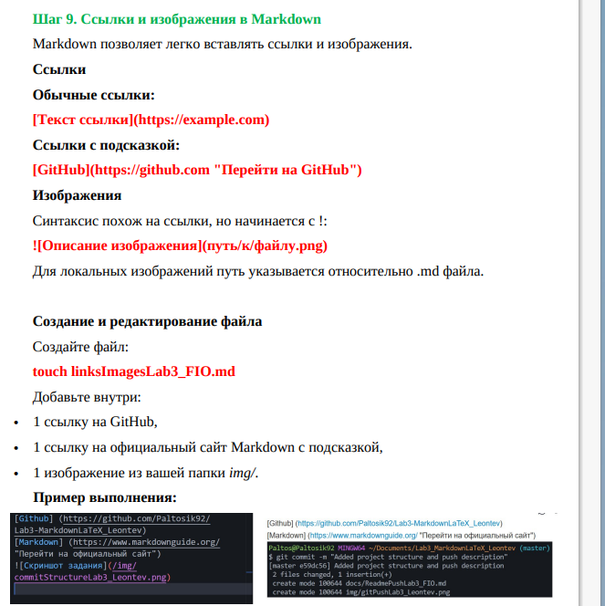

# Лабораторная работа №3
## **Цель**:
Изучить работу с *Markdown-разметкой*. Изучить базовое использование LaTex в документации проекта.[^1]
### **Содержание:**
- [Заголовок](#лабораторная-работа-№3)
- [Содержание](#содержание)
- [Структра проекта](#структура-проекта)
---
### **Структура проекта**
- ~~Списки~~
    - ``вложенные``

- cписок маркированный
- список маркированный 
1. список нумерованный
2. список нумерованный

> это цитата

```csharp
Console.WriteLine("Это блок кода");
```
Столбец 1 |Столбец 2| Столбец 3
|-----|----|-----|
Столбец 1 |Столбец 2| Столбец 3
Столбец 1 |Столбец 2| Столбец 3
Столбец 1 |Столбец 2| Столбец 3



Ссылка на гугл: [Google](https://google.com)
[Внутрення ссылка](docs/latexLab3_Gorbacheva.md)

- [ ] Задача 1 (ещё не выполнена)
- [x] Задача 2 (уже выполнена)
- [ ] Задача 3 (в работе)

[^1]: Это изученые темы

> [!NOTE]
> текст сообщения 1

> [!TYP]
> Текст сообщения 2

> [!WARNING]
> текст сообщения 3

## Примеры LaTex

$\frac{a}{b}$

$$\int_0^\infty e^{-x^2} dx = \frac{\sqrt{\pi}}{2}$$


